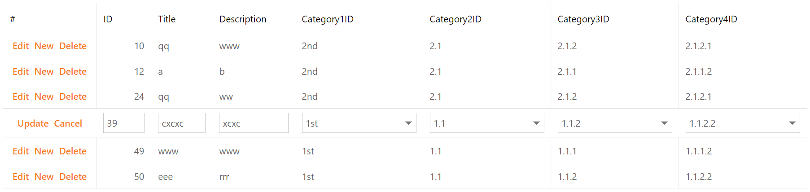

<!-- default badges list -->

[](https://supportcenter.devexpress.com/ticket/details/E1358)
[](https://docs.devexpress.com/GeneralInformation/403183)
[](#does-this-example-address-your-development-requirementsobjectives)
<!-- default badges end -->
# Grid View for ASP.NET Web Forms - How to use cascading combo boxes in inline edit mode

This example demonstrates how to create templated combo box columns, add cascading combo box editors to the templates, and configure the grid's cell edit functionality in inline mode.



## Overview

Add [combo box columns](https://docs.devexpress.com/AspNet/DevExpress.Web.GridViewDataComboBoxColumn) to the grid, specify their [EditItemTemplate](https://docs.devexpress.com/AspNet/DevExpress.Web.GridViewDataColumn.EditItemTemplate) properties, and add combo box editors to the templates.

```aspx
<dx:GridViewDataComboBoxColumn FieldName="Category1ID" VisibleIndex="4">
    <PropertiesComboBox DataSourceID="dsCategory1" TextField="Name" ValueField="ID" ValueType="System.Int32" />
    <EditItemTemplate>
        <dx:ASPxComboBox ID="Cat1" runat="server" DataSourceID="dsCategory1" TextField="Name" ValueField="ID"
            Value='<%# Bind("Category1ID") %>' AutoPostBack="true" ValueType="System.Int32"
            OnSelectedIndexChanged="Cat1_SelectedIndexChanged">
        </dx:ASPxComboBox>
    </EditItemTemplate>
</dx:GridViewDataComboBoxColumn>
```

For every template editor, handle its server-side [SelectedIndexChanged](https://docs.devexpress.com/AspNet/DevExpress.Web.ASPxComboBox.SelectedIndexChanged) event. In handlers, call the grid's [FindEditRowCellTemplateControl](https://docs.devexpress.com/AspNet/DevExpress.Web.ASPxGridView.FindEditRowCellTemplateControl(DevExpress.Web.GridViewDataColumn-System.String)) method to access the subsequent editor and filter its data source based on the selected value of the primary editor.

```cs
protected void Cat1_SelectedIndexChanged(object sender, EventArgs e) {
    ASPxComboBox combo1 = (ASPxComboBox)sender;
    object oldCat1 = Session["Cat1ID"];
    if(oldCat1 != null && oldCat1.Equals(combo1.Value)) return;
    Session["Cat1ID"] = combo1.Value;
    ASPxComboBox combo2 = ((ASPxComboBox)grid.FindEditRowCellTemplateControl(
        grid.Columns["Category2ID"] as GridViewDataComboBoxColumn, "Cat2"));
    combo2.Value = null;
    Cat2_SelectedIndexChanged(combo2, EventArgs.Empty);
}
```

Wrap the grid with an update panel to avoid updating the entire page.

## Files to Review

* [Default.aspx](./CS/MultiCombo/Default.aspx) (VB: [Default.aspx](./VB/MultiCombo/Default.aspx))
* [Default.aspx.cs](./CS/MultiCombo/Default.aspx.cs) (VB: [Default.aspx.vb](./VB/MultiCombo/Default.aspx.vb))

## Documentation

## More Examples

* [Data Editors for ASP.NET Web Forms - Custom callback based implementation of cascading comboboxes in inline mode](https://github.com/DevExpress-Examples/custom-callback-based-implementation-of-cascading-comboboxes-in-inline-mode-e1362)
* [Data Editors for ASP.NET Web Forms - How to edit hierarchical data using cascading comboboxes](https://github.com/DevExpress-Examples/how-to-edit-hierarchical-data-using-cascading-comboboxes-e1346)
<!-- feedback -->
## Does this example address your development requirements/objectives?

[](https://www.devexpress.com/support/examples/survey.xml?utm_source=github&utm_campaign=asp-net-web-forms-grid-use-cascading-combo-boxes-in-inline-edit-mode&~~~was_helpful=yes) [](https://www.devexpress.com/support/examples/survey.xml?utm_source=github&utm_campaign=asp-net-web-forms-grid-use-cascading-combo-boxes-in-inline-edit-mode&~~~was_helpful=no)

(you will be redirected to DevExpress.com to submit your response)
<!-- feedback end -->
